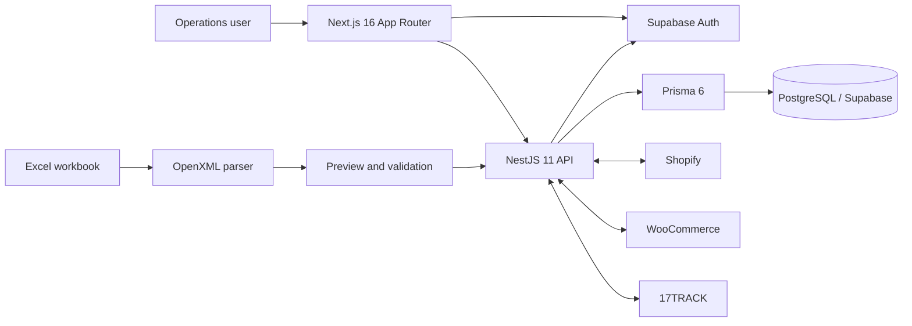
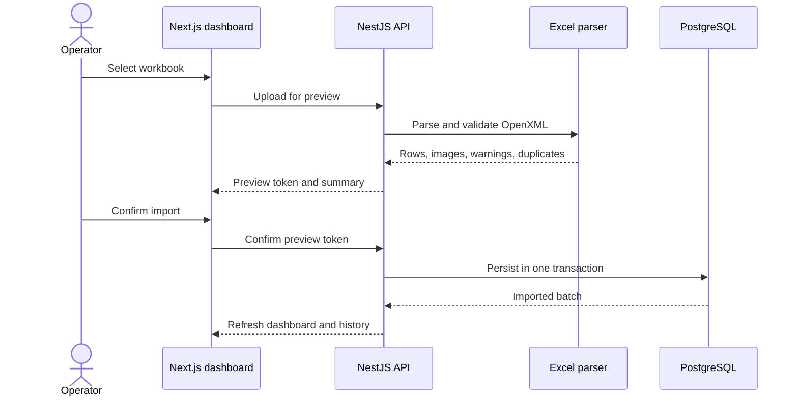

# TanjAI Stock Management

<div align="center">

**One operational workspace for stock, orders, imports, fulfillment, payments, and commerce integrations.**

[](https://www.typescriptlang.org/)
[](https://nextjs.org/)
[](https://nestjs.com/)
[](https://www.prisma.io/)
[](https://www.postgresql.org/)

[Quick start](#quick-start) · [Architecture](#architecture) · [Configuration](#configuration) · [Commands](#commands) · [Documentation](#documentation)

</div>

---

TanjAI Stock Management is a full-stack operations platform for teams that need a reliable view of products, orders, inventory, invoices, payments, and fulfillment activity across Excel-based workflows and connected stores.

It combines a role-aware Next.js dashboard with a NestJS API, PostgreSQL persistence through Prisma, Supabase authentication, safe Excel preview/confirm workflows, and integrations for Shopify, WooCommerce, and 17TRACK.

## Why it exists

Operational data often lives in several places at once: shared workbooks, storefronts, carrier systems, and payment records. TanjAI brings those sources together without forcing users to import data blindly.

- Preview Excel workbooks before anything is written.
- Detect warnings, duplicates, and unmatched product data.
- Refresh imports incrementally instead of replacing thousands of unchanged rows.
- Reconcile API orders against Excel records.
- Manage catalogs, stores, integrations, users, and payment approvals from one interface.
- Restrict every workflow to the people who should have access to it.

## Feature highlights

### Inventory and catalog

- Product catalog with groups, SKU aliases, supplier quotations, freight, fees, and regional cost totals.
- Product imagery with authenticated backend fallback.
- Inventory movements, purchases, stock totals, and product-level drill-downs.
- Dedicated review queue for products without usable SKUs.

### Orders and fulfillment

- Search, filter, sort, paginate, and inspect orders from Excel and connected stores.
- Track shipments individually or register pending shipments in bulk with 17TRACK.
- Reconcile recent API orders that have not yet appeared in Excel.
- Surface fulfillment invoices, anomalies, and operational attention items.

### Safe Excel imports

- Parse `.xlsx` files directly from their OpenXML contents.
- Preview counts, warnings, duplicate records, and sheet metadata before confirmation.
- Confirm, replace, remove, or refresh an import batch.
- Optionally watch a synchronized local workbook directory for stable changes.
- Use incremental refreshes to preserve tracking state and update only changed rows.
- Benchmark full replacement versus incremental refresh inside rolled-back transactions.

### Commerce integrations

- Shopify OAuth installation, per-store connection management, and order synchronization.
- WooCommerce authorization, encrypted credential storage, webhooks, and store synchronization.
- 17TRACK registration, refresh, status, and webhook handling.

### Access and payments

- Supabase authentication with an explicitly opt-in local development login mode.
- User administration and store assignment.
- Deposit requests with proof files and an administrator approval workflow.
- Role-specific navigation and server-side authorization.

## Role-based workspace

| Role | Access |
| --- | --- |
| `TANJAI_ADMIN` | Full dashboard, imports, catalog, orders, stores, invoices, payments, integrations, and user administration |
| `BRAND_OWNER` | Dashboard, products, orders, stores, invoices, payments, and integrations |
| `UFULFILL` | Dashboard, products, missing-SKU review, orders, stores, invoices, and payments |

Unknown or incomplete roles receive no operational sections by default.

## Architecture



The frontend proxies local API traffic through Next.js route handlers, attaches the current access token, and renders only the sections permitted for the authenticated role. The backend remains the authority for authentication, authorization, validation, integration credentials, and database writes.

## Technology stack

| Layer | Technology |
| --- | --- |
| Web application | Next.js 16, React 19, TypeScript, Tailwind CSS 4 |
| Charts | Recharts |
| API | NestJS 11 |
| Authentication | Supabase Auth |
| Data access | Prisma 6 with the PostgreSQL adapter |
| Database | PostgreSQL / Supabase |
| Tests | Jest and ts-jest |
| Code quality | ESLint and Prettier |

## Repository layout

```text
.
├── backend/
│   ├── prisma/
│   │   ├── schema.prisma                 # Application data model
│   │   └── excel-import-tables.sql       # SQL bootstrap/update script
│   ├── scripts/                          # Import audits, schema setup, user seeding
│   └── src/
│       ├── infrastructure/database/      # Prisma lifecycle and adapter
│       └── modules/
│           ├── auth/                     # Supabase and admin guards
│           ├── dashboard/                # Metrics, filters, reconciliation
│           ├── imports/                  # Excel parsing, preview, persistence
│           ├── payments/                 # Deposit request workflow
│           ├── platform/                 # HTTP API controller
│           ├── shopify/                  # Shopify integration
│           ├── tracking/                 # 17TRACK integration
│           ├── users/                    # User and store access management
│           └── woocommerce/              # WooCommerce integration
├── frontend/
│   ├── public/                            # Integration brand assets
│   └── src/
│       ├── app/                           # Pages, API proxy, callbacks, webhooks
│       ├── features/                      # Auth and dashboard feature UI
│       └── lib/                           # API and Supabase clients
├── scripts/                               # Cross-project benchmark tooling
├── docs/                                  # Interactive project presentation
└── APP_OVERVIEW.md                        # Extended architecture notes
```

## Quick start

### Prerequisites

- Node.js 20.9 or newer
- npm
- A PostgreSQL database, preferably a Supabase project
- Supabase project credentials

### 1. Clone the repository

```bash
git clone https://github.com/GHJKLF/tanjai-stock-management.git
cd tanjai-stock-management
```

### 2. Configure and start the backend

```bash
cd backend
npm ci
cp .env.example .env
npm run prisma:generate
npm run start:dev
```

On Windows PowerShell, replace the copy command with:

```powershell
Copy-Item .env.example .env
```

The API starts on `http://localhost:3005` unless `PORT` is configured.

Before the first database-backed import, provision the schema using the workflow appropriate for your environment:

```bash
npm run db:apply-import-schema
# or, when managing the schema through Prisma migrations:
npm run prisma:migrate
```

### 3. Configure and start the frontend

In a second terminal:

```bash
cd frontend
npm ci
cp .env.example .env.local
npm run dev
```

On Windows PowerShell:

```powershell
Copy-Item .env.example .env.local
```

Open [http://localhost:3000](http://localhost:3000).

## Configuration

Never commit `.env` or `.env.local`. Start from the committed templates:

- [`backend/.env.example`](backend/.env.example) documents database, authentication, import, store-integration, tracking, and development-login settings.
- [`frontend/.env.example`](frontend/.env.example) contains the three public frontend values.

### Frontend variables

| Variable | Purpose |
| --- | --- |
| `NEXT_PUBLIC_SUPABASE_URL` | Supabase project URL |
| `NEXT_PUBLIC_SUPABASE_ANON_KEY` | Browser-safe Supabase anonymous key |
| `NEXT_PUBLIC_API_URL` | NestJS API URL; defaults to `http://localhost:3005` |

### Backend configuration groups

| Group | Important variables |
| --- | --- |
| Database | `DATABASE_URL` |
| Browser access | `FRONTEND_URLS` |
| Excel imports | `EXCEL_IMPORT_DIR`, `EXCEL_IMPORT_STORAGE`, `EXCEL_INCREMENTAL_REFRESH`, `EXCEL_AUTO_REFRESH` |
| Supabase | `SUPABASE_URL`, `SUPABASE_SERVICE_ROLE_KEY` |
| Shopify | `SHOPIFY_CLIENT_ID`, `SHOPIFY_CLIENT_SECRET`, callback/install URLs and scopes |
| WooCommerce | callback/return/webhook URLs and `WOOCOMMERCE_CREDENTIALS_ENCRYPTION_KEY` |
| 17TRACK | `TRACK17_API_KEY`, API/webhook URLs, and `TRACK17_ENABLED` |
| Development login | `LOCAL_DEV_AUTH_ENABLED` and the role-specific development credentials |

> `SUPABASE_SERVICE_ROLE_KEY`, Shopify secrets, WooCommerce credentials, and tracking keys belong only in the backend environment.

## Data import lifecycle



For recurring workbooks, full replacement remains available while incremental refresh can update only changed records and preserve shipment-tracking state. Validate incremental mode on staging before enabling it in production.

## Useful commands

Run commands from the relevant application directory.

### Backend

| Command | Purpose |
| --- | --- |
| `npm run start:dev` | Start NestJS in watch mode |
| `npm run build` | Create the production build |
| `npm run start:prod` | Run the compiled API |
| `npm test -- --runInBand` | Run all Jest tests serially |
| `npm run lint` | Lint and apply supported fixes |
| `npm run format` | Format backend TypeScript |
| `npm run prisma:generate` | Generate the Prisma client |
| `npm run prisma:migrate` | Create/apply a development migration |
| `npm run db:apply-import-schema` | Apply the included Excel-import SQL schema |
| `npm run seed:dev-users` | Seed configured development users |

### Frontend

| Command | Purpose |
| --- | --- |
| `npm run dev` | Start the Next.js development server |
| `npm run build` | Build and type-check the production app |
| `npm start` | Run the production build |
| `npm run lint` | Run Next.js ESLint rules |

### Refresh benchmark

After building the backend, compare full replacement with incremental refresh without committing database changes:

```bash
cd backend
npm run build
node ../scripts/benchmark-refresh.mjs
```

Use `--incremental-only` for the faster, lower-risk validation path. See [`scripts/refresh-benchmark.md`](scripts/refresh-benchmark.md) for arguments, methodology, and result interpretation.

## API surface

The API is organized around a small number of operational capabilities:

| Area | Examples |
| --- | --- |
| Authentication | Login and current-user profile |
| Dashboard | Summary, filtered sections, product and inventory detail |
| Imports | Preview, confirm, history, replace, remove, and refresh |
| Catalog | Products, product groups, pictures, and stores |
| Payments | Deposit submission, review, proof retrieval, and reporting |
| Users | Creation, role/store assignment, password updates, and removal |
| Shopify | Install, callback, connection status, sync, and disconnect |
| WooCommerce | Authorization, callback, sync, webhook, and disconnect |
| 17TRACK | Status, shipment registration/refresh, and webhook ingestion |

Protected endpoints expect `Authorization: Bearer <token>`. Production deployments should use Supabase-issued access tokens.

## Security checklist

- Keep local development authentication disabled in production.
- Never expose the Supabase service-role key or commerce integration secrets to the browser.
- Generate a strong 32-byte WooCommerce credential-encryption key.
- Restrict `FRONTEND_URLS` to trusted application origins.
- Use HTTPS for OAuth callbacks and webhook endpoints.
- Validate Excel imports in preview before confirmation.
- Back up the database before schema changes or large import replacements.

## Verification

Before opening a pull request or deploying:

```bash
cd backend
npm test -- --runInBand
npm run build

cd ../frontend
npm run lint
npm run build
```

Strict unused-code checks can be run in either application with:

```bash
npx tsc --noEmit --noUnusedLocals --noUnusedParameters
```

## Documentation

- [`APP_OVERVIEW.md`](APP_OVERVIEW.md) — extended application architecture and flow notes.
- [`docs/project-presentation.html`](docs/project-presentation.html) — interactive project presentation.
- [`backend/README.md`](backend/README.md) — backend-focused setup notes.
- [`frontend/README.md`](frontend/README.md) — frontend-focused setup notes.
- [`scripts/refresh-benchmark.md`](scripts/refresh-benchmark.md) — safe refresh-performance benchmark guide.

## Operational notes

- The frontend and backend are independent npm applications; install and run them separately.
- The backend can store imports locally for development or in PostgreSQL through Prisma.
- Automatic workbook refresh waits for files to stabilize and throttles repeated automatic updates.
- Manual refresh remains available between scheduled refreshes.
- Public callback/webhook routes in Next.js forward requests to the backend so integration secrets stay server-side.

## License

This repository is private, unlicensed software. No permission is granted to use, copy, modify, or distribute it without the owner's approval.

---

<div align="center">

Built to turn scattered operational data into one dependable source of truth.

</div>
